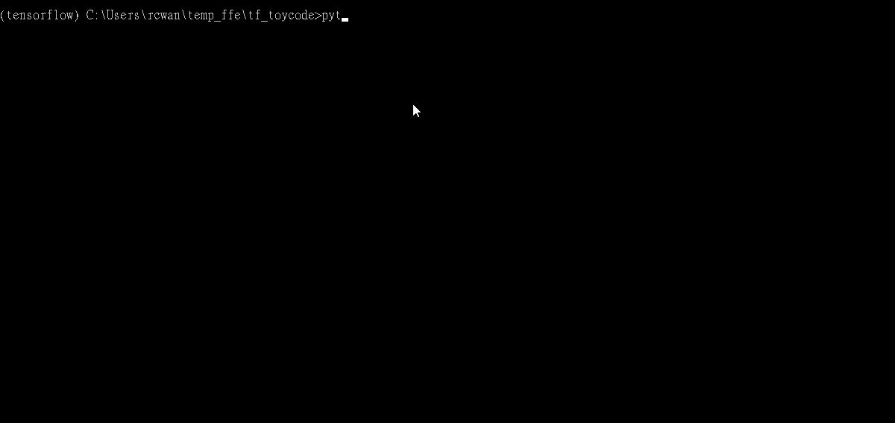

# TensorFlow Demo

程式碼中都有詳細說明，寫法可能很怪，還請見諒

# 安裝流程

1. 請先安裝 `tensorflow` , 根據官網安裝

2. 使用 `Anaconda 3` 的朋友，請依照官網教學建立環境

3. 請補全需要的套件：

```
pip install -r requirements.txt
```

# 使用方法

1. `data` 目錄下有一個 `bitcoin` 資料夾，裡面有 up down 開頭的圖片


2. 在 `create_tfrecords.py` 中設定好 `label` 判定方法，執行：

```
python create_tfrecords.py
```

會在目錄下得到 `train.tfrecords` 和 `test.tfrecords`


3. 接著開始訓練，執行

```
python train.py
```


會在目錄底下開始訓練，並每 `SAVE_WEIGHTS_STEP` 會把第一層權重輸出到 `logs/weights` 中

你也可以看看 `logs.example` 裡面輸出的樣子

